# Local

## Description

This project is about privilege escalation. Privilege escalation is a security vulnerability and exploitation concept that involves an attacker gaining higher levels of access, control, or privileges on a computer system or network than they are initially authorized to have. In other words, it's the process of moving from a lower-privileged user account to a higher-privileged one, such as from a standard user to an administrator or root account. This escalation of privileges can potentially allow an attacker to perform unauthorized actions, access sensitive data, or compromise the integrity of the system. Privilege escalation can occur through various methods, each with its own techniques and vulnerabilities. In this project we are using vertical privilege escalation.


## Project Instructions

### Setup

 1. [Download and install VirtualBox](https://www.virtualbox.org/wiki/Downloads)
 2. [Download the VM 01-Local1.ova](https://assets.01-edu.org/cybersecurity/local/01-Local.ova)
 2.1 If the VM is already downloaded, check the SHA1 by running: ```sha1sum 01-Local1.ova```

   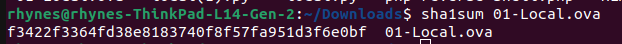

 3. Download the required tools (nmap) or alternatively download Kali linux, which has all the required tools, and run it VirtualBox
 4. Clone this repo for the scripts
 5. [Import the 01-Local1.ova VM into VirtualBox](https://help.okta.com/oag/en-us/Content/Topics/Access-Gateway/deploy-ovb.htm)
 6. Start the 01-Local VM within VirtualBox.

### Step 1: Discover the IP Address and the open ports
    
 Use ```ifconfig``` to to find your ip (Newer distros might have ```ip``` instead)
    
   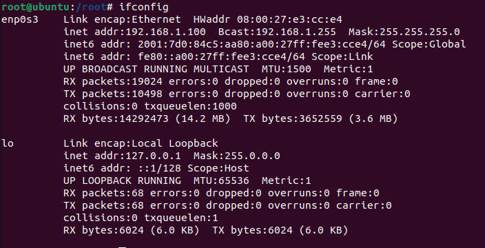

 Then ```nmap -sP (replace with your ip)/24``` to reveal the IP Address and the ports

   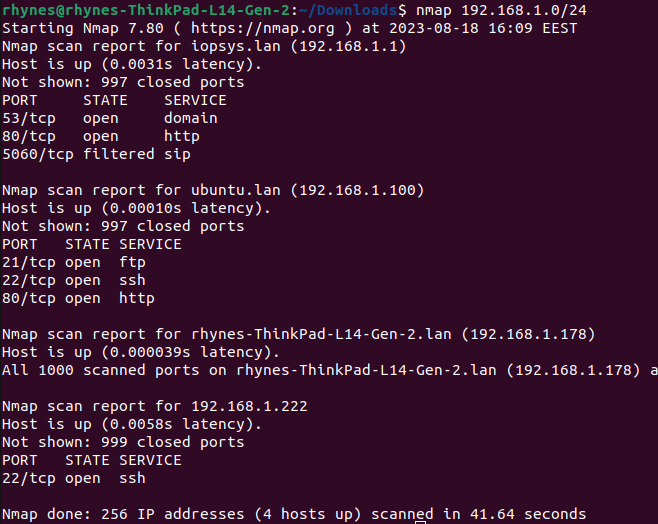

 Looking at the ports we find out that port 21 allows anonymous FTP login and port 80 is running an Apache web server.

 We can also check the files in the browser with the url: ```(the scanned ip)/files```

   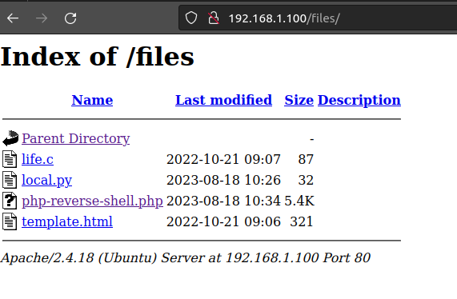
    
### Step 2: Upload Essential Files
    
 Since the system allows anonymous FTP login we can access it by using the ```ftp (your ip)``` command
 We can upload the required files with ```put php-reverse-shell.php``` and ```put local.py```

   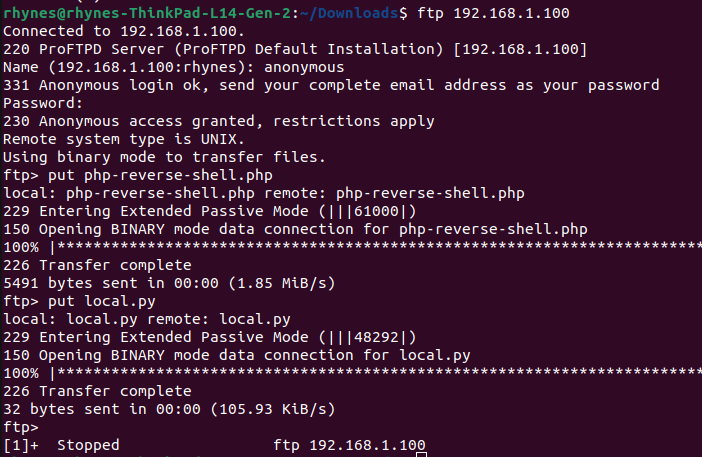

### Step 3: Activate the Reverse Shell
    
 We need to start an nc listener first with ```nc -lnvp 1234```
 Then start the script by clicking on it in the browser ```(the scanned ip)/files```
    
   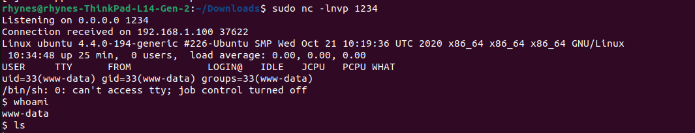

### Step 4: Uncover Credentials

 Snoop around and find something important in the home folder.

  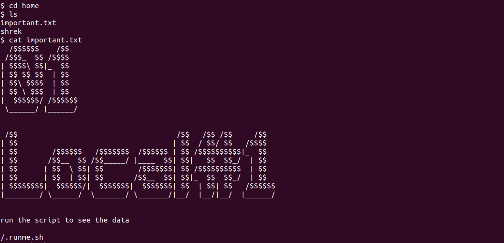

 Browse the filesystem to locate /.runme.sh.
 Examine its contents using ```cat /.runme.sh``` to unveil the username (shrek) and a hashed password.

  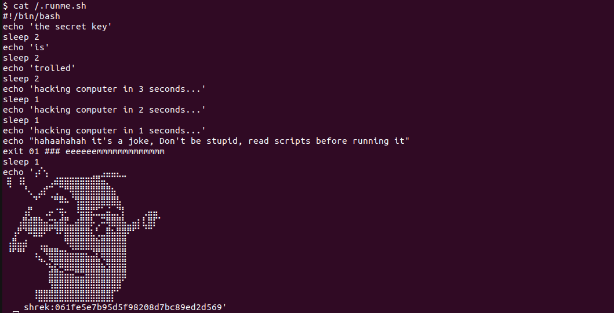

 Decode the password hash using [an online tool](https://www.dcode.fr/hash-function)

### Step 5: Gain Root Access

 Log in as user "shrek" with ssh.
 Lets look at our sudo permissions with ```sudo -l``` 
    - we can run Python3.5 scipts as root 

   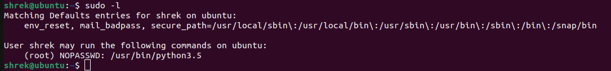

 Now we need to locate the local.py we uploaded earlier from ```/var/www/html/files```
 And run it with ```sudo python3.5 local.py```
    
   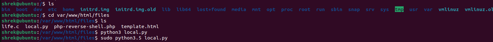

### Step 6: The flag

 Now that we have root access we can also access the /root folder
 There is a file there called root.txt
 By using the command ```cat root.txt``` we can see it 
    
   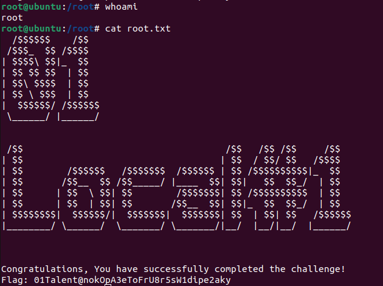

### Step 5 ALT: Alternative to gaining root

 Linux ha a tool called linpeas, which is used to find vulnerabilities.
 Using that we find a privilage escalation vulnerability called CVE-2021-4034.
 It also provides a link to a script to exploit said vulnerability.
 Upload the script and run it and gin the pwer of root.

## Used exploits and how to fix them.

- **Close Port 21 or Disable Anonymous Login:** Port 21 is associated with an FTP server, which, if configured with anonymous login enabled, can be exploited to gain unauthorized access. To prevent this, administrators should disable anonymous login or restrict FTP access altogether.

- **Secure Handling of User Credentials:** Storing user credentials in files, as demonstrated in this exercise, is a security vulnerability. To mitigate this risk, sensitive information like usernames and passwords should never be stored in plain text files. Instead, administrators should implement secure credential management practices, such as using encrypted databases or secure key storage mechanisms.

- **Restrict User Privileges:** Granting users unrestricted sudo privileges, as seen with the Python3.5 execution in this project, is a security concern. To bolster security, administrators should strictly control and limit users' sudo permissions. Unnecessary privileges should be revoked, and users should only have access to commands and operations essential for their tasks.
